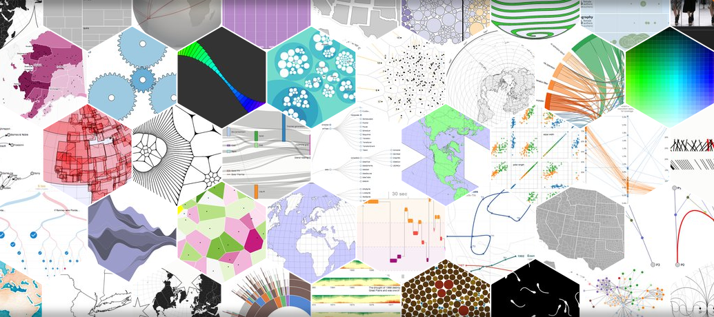

# Data Visualization_데이터 시각화

[출처: D3 홈페이지(https://d3js.org/)]

## 다뤄보고 싶은 주제

#### GIS
  - [OpenLayers](https://openlayers.org/)
  - [Leaflet](https://leafletjs.com/)
  - [QGIS](https://www.qgis.org/ko/site/)
  - [GeoServer](http://geoserver.org/)
  - ...

#### 데이터 시각화
  - [D3](https://d3js.org/)
  - 각종 차트 Tools
  - 각종 Grid Tools
  - ...

#### 데이터 분석
  - [R](https://www.r-project.org/)
  - [파이썬](https://www.python.org/)
  - ...

## 시작하며

  언젠가는 내용이 꽉 들어차겠지만,
  시작하는 현재의 시점에서는
  어느정도 시간이 걸릴지 
  어떠한 깊이의 내용들이 다루어질지 등에 대한 개념은 아직 없다.
  채워가면서 유연하게 조정하는 걸로......

### License
Entire Free
